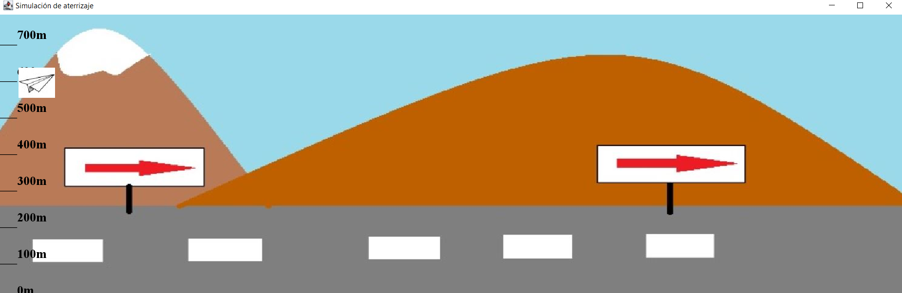

```{r global_options, include=FALSE}
knitr::opts_chunk$set(fig.pos = 'H', warning = FALSE)
library(latex2exp)
library(DescTools)
```


# Problema 1 
\index{Problema 1}
Supongamos que para una cierta aplicación definimos unos conjuntos borrosos con estas funciones de pertenencia:
\[\mu_{A}\left(x\right)=\frac{1}{1+e^{-2\left(x-4\right)}}\]
\[\mu_{B}\left(x\right)=\frac{1}{1+e^{3\left(x-5\right)}}\] 
definidos sobre el universo $X=\left[0,10\right]$. Calcular, analítica y gráficamente, la unión, la intersección, los complementos, las diferencias, las dos leyes de Morgan, la ley del medio excluido y la ley de la contradicción.

Para la resolución de este ejercicio, seguimos las definiciones proporcionadas en los apuntes de clase [@PalmaConjuntosBorrosos], así como los ejemplos resueltos [@BotiaConjuntosBorrosos].
Primero, notamos que los conjuntos asociados a estas relaciones de pertenencia son:
\[A=\int_{x\in\left[0,10\right]}\mu_{A}\left(x\right)/x=\int_{x\in\left[0,10\right]}\frac{1}{1+e^{-2\left(x-4\right)}}/x\]
\[B=\int_{x\in\left[0,10\right]}\mu_{B}\left(x\right)/x=\int_{x\in\left[0,10\right]}\frac{1}{1+e^{3\left(x-5\right)}}/x\]
Que tienen la siguiente pinta:

```{r echo=FALSE, fig.pos="H", fig.width=8}
U <- seq(from=0,to=10,by=0.01)
muA <- function(x) {return (1/(1+exp(-2*(x-4))))} 
muB <- function(x) {return (1/(1+exp(3*(x-5))))} 
maximo <- function(x) {return (max(muA(x),muB(x)))}
plot(x=U, y=muA(U), main="Conjuntos A y B", col="blue", type="l", ylab="Pertenencia", xlab="Universo",ylim=c(0,1))
lines(x=U, y=muB(U), col="red")
legend("right", fill=c("blue", "red"), legend=c("A", "B"))
```

Para calcular la \textbf{unión}, basta tomar el máximo de ambas, gráficamente queda:

```{r echo=FALSE, fig.pos="H", fig.width=8}
plot(x=U, y=(muA(U)+muB(U)+abs(muA(U)-muB(U)))/2, main=TeX('$A\\bigcup B$'), col="orange", type="l", ylab="Pertenencia", xlab="Universo", ylim=c(0,1))
legend("right", fill=c("orange"), legend=c(TeX('$A\\bigcup B}$')))
```
Para hacerlo analíticamente:

\[\mu_{A}\left(x\right)\geq\mu_{B}\left(x\right)\iff\frac{1}{1+e^{-2\left(x-4\right)}}\geq\frac{1}{1+e^{3\left(x-5\right)}}\iff e^{-2\left(x-4\right)}\leq e^{3\left(x-5\right)}\iff\]
\[\iff-2\left(x-4\right)\leq3\left(x-5\right)\iff x-4\geq-\frac{3}{2}\left(x-5\right)\iff\frac{5}{2}x\geq\frac{23}{2}\iff x\geq\frac{23}{5}\]

Por tanto, es
\[\mu_{A\cup B}\left(x\right)=\begin{cases}
\mu_{B}\left(x\right) & x\leq\frac{23}{5}\\
\mu_{A}\left(x\right) & x>\frac{23}{5}
\end{cases}\]

Para la \textbf{intersección}, lo que hacemos es el mínimo, que es igual que antes, pero tomando la función recíproca:
\[\mu_{A\cap B}\left(x\right)=\begin{cases}
\mu_{A}\left(x\right) & x\leq\frac{23}{5}\\
\mu_{B}\left(x\right) & x>\frac{23}{5}
\end{cases}\]

De forma visual:

```{r echo=FALSE, fig.pos="H", fig.width=8}
plot(x=U, y=(muA(U)+muB(U)-abs(muA(U)-muB(U)))/2, main=TeX('$A\\bigcap B$'), col="orange", type="l", ylab="Pertenencia", xlab="Universo", ylim=c(0,1))
legend("right", fill=c("orange"), legend=c(TeX('$A\\bigcap B$')))
```

Para el \textbf{complementario} simplement hay que tomar las funciones de pertenencia complementarias, es decir
\[\mu_{\overline{A}}\left(x\right)=1-\mu_{A}\left(x\right)=1-\frac{1}{1+e^{-2\left(x-4\right)}}=\frac{e^{-2\left(x-4\right)}}{1+e^{-2\left(x-4\right)}}=\frac{1}{e^{2\left(x-4\right)}+1}=\frac{1}{1+e^{2\left(x-4\right)}}\]
\[\mu_{\overline{B}}\left(x\right)=1-\mu_{B}\left(x\right)=1-\frac{1}{1+e^{3\left(x-5\right)}}=\frac{e^{3\left(x-5\right)}}{1+e^{3\left(x-5\right)}}=\frac{1}{e^{-3\left(x-5\right)}+1}=\frac{1}{1+e^{-3\left(x-5\right)}}\]
y gráficamente:

```{r echo=FALSE, fig.pos="H", fig.width=7}
U <- seq(from=0,to=10,by=0.01)
muA <- function(x) {return (1/(1+exp(-2*(x-4))))} 
muB <- function(x) {return (1/(1+exp(3*(x-5))))} 
plot(x=U, y=1-muA(U), main=TeX('Conjuntos $\\bar{A}$ y $\\bar{B}$'), col="blue", type="l", ylab="Pertenencia", xlab="Universo",ylim=c(0,1))
lines(x=U, y=1-muB(U), col="red")
legend("right", fill=c("blue", "red"), legend=c(TeX('$\\bar{A}$'), TeX('$\\bar{B}$')))
```

Vamos ahora a calcular la \textbf{diferencia}:
\[\mu_{A\setminus B}\left(x\right)=\mu_{A\cap\overline{B}}\left(x\right)=\min\left\{ \mu_{A}\left(x\right),\mu_{\overline{B}}\left(x\right)\right\}\]
Primero, gráficamente:

```{r echo=FALSE, fig.pos="H", fig.width=8}
plot(x=U, y=(muA(U)+1-muB(U)-abs(muA(U)-1+muB(U)))/2, main="A|B", col="orange", type="l", ylab="Pertenencia", xlab="Universo", ylim=c(0,1))
legend("right", fill=c("orange"), legend=c("A|B"))
```
Para hacerlo analíticamente, tenemos que calcular el máximo de las funciones de pertenencia:
\[\mu_{A}\left(x\right)\geq\mu_{\overline{B}}\left(x\right)\iff\frac{1}{1+e^{-2\left(x-4\right)}}\geq\frac{1}{1+e^{-3\left(x-5\right)}}\iff-2\left(x-4\right)\geq-3\left(x-5\right)\iff\]
\[\iff x-4\leq\frac{3}{2}\left(x-5\right)\iff-\frac{x}{2}\leq\frac{-15+8}{2}=\frac{-7}{2}\iff-x\leq-7\iff x\geq7\]
Por lo tanto, es
\[\mu_{A\setminus B}\left(x\right)=\begin{cases}
\mu_{\overline{B}}\left(x\right) & x\leq7\\
\mu_{A}\left(x\right) & x>7
\end{cases}\]

Y la otra diferencia es
\[\mu_{B\setminus A}\left(x\right)=\mu_{B\cap\overline{A}}\left(x\right)=\min\left\{ \mu_{B}\left(x\right),\mu_{\overline{A}}\left(x\right)\right\}\]

Que gráficamente queda:

```{r echo=FALSE, fig.pos="H", fig.width=8}
plot(x=U, y=(muB(U)+1-muA(U)-abs(muB(U)-1+muA(U)))/2, main="B|A", col="orange", type="l", ylab="Pertenencia", xlab="Universo", ylim=c(0,1))
legend("right", fill=c("orange"), legend=c("B|A"))
```

Y analíticamente, igual que antes:
\[\mu_{B}\left(x\right)\geq\mu_{\overline{A}}\iff\frac{1}{1+e^{3\left(x-5\right)}}\geq\frac{1}{1+e^{2\left(x-4\right)}}\iff3\left(x-5\right)\leq2\left(x-4\right)\iff\]
\[\iff x-5\leq\frac{2}{3}\left(x-4\right)\iff\frac{x}{3}\leq\frac{7}{3}\iff x\leq7\]
por lo que la función de pertenencia es
\[\mu_{B\setminus A}\left(x\right)=\begin{cases}
\mu_{B}\left(x\right) & x\leq7\\
\mu_{\overline{A}}\left(x\right) & x>7
\end{cases}\]

Respecto a las \textbf{leyes de Morgan}, son
\[\mu_{\overline{A\cup B}}\left(x\right)=1-\mu_{A\cup B}\left(x\right)=\begin{cases}
1-\mu_{B}\left(x\right) & x\leq\frac{23}{5}\\
1-\mu_{A}\left(x\right) & x>\frac{23}{5}
\end{cases}=\begin{cases}
\mu_{\overline{B}}\left(x\right) & x\leq\frac{23}{5}\\
\mu_{\overline{A}}\left(x\right) & x>\frac{23}{5}
\end{cases}=\mu_{\overline{A}\cap\overline{B}}\]
siendo cierta esta igualdad, ya que se tiene la siguiente cadena de desigualdades
\[\mu_{\overline{B}}\left(x\right)\leq\mu_{\overline{A}}\left(x\right)\iff\frac{1}{1+e^{-3\left(x-5\right)}}\leq\frac{1}{1+e^{2\left(x-4\right)}}\iff-3\left(x-5\right)\geq2\left(x-4\right)\iff\]
\[\iff x-5\leq-\frac{2}{3}\left(x-4\right)\iff\frac{5}{3}x\leq\frac{23}{3}\iff x\leq\frac{23}{5}\]

Para la otra ley, repetimos un proceso análogo:
\[\mu_{\overline{A\cap B}}\left(x\right)=1-\mu_{A\cap B}\left(x\right)=\begin{cases}
\mu_{\overline{A}}\left(x\right) & x\leq\frac{23}{5}\\
\mu_{\overline{B}}\left(x\right) & x>\frac{23}{5}
\end{cases}=\mu_{\overline{A}\cup\overline{B}}\]

Y vemos ambas leyes gráficamente:

```{r echo=FALSE, fig.pos="H", fig.width=8}
plot(x=U, y=(1-muB(U)+1-muA(U)-abs(1-muB(U)-1+muA(U)))/2, main="Leyes de Morgan", col="orange", type="l", ylab="Pertenencia", xlab="Universo", ylim=c(0,1))
lines(x=U, y=(1-muB(U)+1-muA(U)+abs(1-muB(U)-1+muA(U)))/2, col="violet")
legend("right", fill=c("orange", "violet"), legend=c(TeX('$\\bar{A\\bigcup B}$'), TeX('$\\bar{A\\bigcap B}$')))
```

Tratando la \textbf{ley de la contradicción}, observamos que en los apuntes de clase [@PalmaConjuntosBorrosos] se usa la fórmula $A\cup\overline{A}$, pero esto no concuerda con nuestros conocimientos de lógica. Sabemos que una contradicción se da cuando a partir de unas premisas obtenemos una afirmación y su contraria, y esto nos permite concluir que las premisas no son consistentes. O sea, que para que un conjunto de premisas sea consistente, se requiere que o bien una afirmación, o bien su contraria, sean ciertas, pero que no lo sean ambas simultáneamente. Es decir, que $A\cap\overline{A}=\emptyset$. Esto podemos corroborarlo en [@Stanford]. Así, calculamos la ley de la contradicción para conjuntos borrosos de la siguiente forma:

\[\mu_{A\cap\overline{A}}\left(x\right)=\min\left\{ \mu_{A}\left(x\right),\mu_{\overline{A}}\left(x\right)\right\} \]
y se tiene que
\[\mu_{A}\left(x\right)\leq\mu_{\overline{A}}\left(x\right)\iff\frac{1}{1+e^{-2\left(x-4\right)}}\leq\frac{1}{1+e^{2\left(x-4\right)}}\iff-2\left(x-4\right)\geq2\left(x-4\right)\iff\]
\[4-x\geq x-4\iff8\geq2x\iff x\leq4\]
por lo que la función de pertenencia es
\[\mu_{A\cap\overline{A}}\left(x\right)=\begin{cases}
\mu_{A}\left(x\right) & x\leq4\\
\mu_{\overline{A}}\left(x\right) & x>4
\end{cases}\]

Antes de hacerlo gráficamente, lo hacemos para el conjunto $B$. Se tiene la siguiente cadena de equivalencias:
\[\mu_{B}\left(x\right)\leq\mu_{\overline{B}}\left(x\right)\iff\frac{1}{1+e^{3\left(x-5\right)}}\leq\frac{1}{1+e^{-3\left(x-5\right)}}\iff3\left(x-5\right)\geq-3\left(x-5\right)\iff\]
\[\iff x-5\geq5-x\iff2x\geq10\iff x\geq5\]
y entonces
\[\mu_{B\cap\overline{B}}\left(x\right)=\begin{cases}
\mu_{\overline{B}}\left(x\right) & x\leq5\\
\mu_{B}\left(x\right) & x>5
\end{cases}\]

Lo vemos gráficamente:

```{r echo=FALSE, fig.pos="H", fig.width=8}
plot(x=U, y=(muA(U)+1-muA(U)-abs(muA(U)-1+muA(U)))/2, main="Ley de la contradicción", col="blue", type="l", ylab="Pertenencia", xlab="Universo", ylim=c(0,1))
lines(x=U, y=(muB(U)+1-muB(U)-abs(muB(U)-1+muB(U)))/2, col="red")
legend("right", fill=c("blue", "red"), legend=c(TeX('$A\\bigcap\\bar{A}$'), TeX('$B\\bigcap\\bar{B}$')))
```

Respecto a la \textbf{ley del medio excluido}, encontramos en los apuntes de clase [@PalmaConjuntosBorrosos] que debemos calcular la intersección de cada conjunto con su complementario. De nuevo, esto no concuerda con nuestros conocimientos previos sobre la ley del medio excluido, que asegura que bien una proposición o bien su contraria deben ser ciertas bajo ciertas premisas, y que estas dos opciones completan el espacio proposicional. Es decir, que $A\cup \overline{A}=U$. Esto lo corroboramos otra vez en [@Stanford], y usaremos esta fórmula para calcularlo.

\[\mu_{A\cup\overline{A}}\left(x\right)=\mu_{\overline{\overline{A\cup\overline{A}}}}\left(x\right)=1-\mu_{\overline{A\cup\overline{A}}}\left(x\right)=1-\mu_{\overline{A}\cap A}\left(x\right)=\begin{cases}
1-\mu_{A}\left(x\right) & x\leq4\\
1-\mu_{\overline{A}}\left(x\right) & x>4
\end{cases}=\begin{cases}
\mu_{\overline{A}}\left(x\right) & x\leq4\\
\mu_{A}\left(x\right) & x>4
\end{cases}\]
Obsérvese que no es más que el complementario de la ley del medio excluido. Para $B$, más de lo mismo:
\[\mu_{B\cup\overline{B}}\left(x\right)=\mu_{\overline{\overline{B\cup\overline{B}}}}\left(x\right)=1-\mu_{\overline{B\cup\overline{B}}}\left(x\right)=1-\mu_{\overline{B}\cap B}\left(x\right)=\begin{cases}
1-\mu_{\overline{B}}\left(x\right) & x\leq5\\
1-\mu_{B}\left(x\right) & x>5
\end{cases}=\begin{cases}
\mu_{B}\left(x\right) & x\leq5\\
\mu_{\overline{B}}\left(x\right) & x>5
\end{cases}\]

Y vemos ambos de forma gráfica:

```{r echo=FALSE, fig.pos="H", fig.width=8}
plot(x=U, y=(1-(muA(U)+1-muA(U)-abs(muA(U)-1+muA(U)))/2), main="Ley del medio excluido", col="blue", type="l", ylab="Pertenencia", xlab="Universo", ylim=c(0,1))
lines(x=U, y=(1-(muB(U)+1-muB(U)-abs(muB(U)-1+muB(U)))/2), col="red")
legend("right", fill=c("blue", "red"), legend=c(TeX('$A\\bigcup\\bar{A}$'), TeX('$B\\bigcup\\bar{B}$')))
```

# Problema 2

Supongamos que estamos diseñando un sistema para localizar objetos y formas en una imagen. Un objeto determinado puede ser considerado grande o pequeño, si el número de píxeles consecutivos en la matriz que representa la imagen está por encima o por debajo de un determinado valor. Si definimos el universo de discurso del número de píxeles consecutivos por encima del valor de referencia como $\left[50,300\right]$, podemos definir los siguientes conjuntos borrosos:
\["Grande"=\left\{ \frac{0}{50}+\frac{0.2}{100}+\frac{0.3}{150}+\frac{0.8}{200}+\frac{0.9}{250}+\frac{1}{300}\right\} \]
\["Pequeño"=\left\{ \frac{1}{50}+\frac{0.5}{100}+\frac{0.1}{150}+\frac{0}{200}+\frac{0}{250}+\frac{0}{300}\right\} \]
donde las distintas formas detectadas se pueden expresar en los siguientes términos:

1. Muy grande

2. Más que muy grande

3. No muy grande y más o menos pequeño

4. Muy muy grande y no pequeño

5. Muy pequeño y no grande

6. Bastante grande (=grande$^{\frac{2}{3}}$)

7. Ni muy pequeño ni muy grande

8. Pequeño o no muy pequeño

Calcular las funciones de pertenencia para cada uno de los términos anteriores.

Vamos a calcular las funciones de pertenencia tal y como se definen en los apuntes de clase [@PalmaLogicaBorrosa]. De esta manera, y teniendo en cuenta que
\[\mu_{Grande}\left(x\right)=\begin{cases}
0 & x=50\\
0.2 & x=100\\
0.3 & x=150\\
0.8 & x=200\\
0.9 & x=250\\
1 & x=300
\end{cases}\quad \mu_{Pequeño}\left(x\right)=\begin{cases}
1 & x=50\\
0.5 & x=100\\
0.1 & x=150\\
0 & x=200\\
0 & x=250\\
0 & x=300
\end{cases}\]
sería:

1. Muy grande: 
\[\mu_{MUY\ Grande}\left(x\right)=\mu_{Grande}\left(x\right)^{2}=\begin{cases}
0 & x=50\\
0.04 & x=100\\
0.09 & x=150\\
0.64 & x=200\\
0.81 & x=250\\
1 & x=300
\end{cases}\]

2. Más que muy grande:
\[\mu_{MAS\ MUY\ Grande}\left(x\right)=\mu_{MUY\ Grande}\left(x\right)^{1.25}=\begin{cases}
0 & x=50\\
0.01788854 & x=100\\
0.04929503 & x=150\\
0.5724334 & x=200\\
0.7684335 & x=250\\
1 & x=300
\end{cases}\]

3. No muy grande y más o menos pequeño: este caso tiene un poco más de complejidad. Primero, hacemos 'no muy grande':
\[\mu_{NO\ MUY\ Grande}\left(x\right)=1-\mu_{MUY\ Grande}\left(x\right)=\begin{cases}
1 & x=50\\
0.96 & x=100\\
0.91 & x=150\\
0.36 & x=200\\
0.09 & x=250\\
0 & x=300
\end{cases}\]
Ahora hacemos 'más o menos pequeño':
\[\mu_{MASMENOS\ Pequeño}\left(x\right)=\mu_{Pequeño}\left(x\right)^{\frac{1}{2}}=\begin{cases}
1 & x=50\\
0.7071068 & x=100\\
0.3162278 & x=150\\
0 & x=200\\
0 & x=250\\
0 & x=300
\end{cases}\]
Y lo pedido por el enunciado es su intersección, o sea, el mínimo de las funciones de pertenencia:
\[\mu_{NO\ MUY\ Grande\ Y\ MASMENOS\ Pequeño}\left(x\right)=\min\left\{ \mu_{NO\ MUY\ Grande}\left(x\right),\mu_{MASMENOS\ Pequeño}\left(x\right)\right\} =\]
\[=\begin{cases}
1 & x=50\\
0.7071068 & x=100\\
0.3162278 & x=150\\
0 & x=200\\
0 & x=250\\
0 & x=300
\end{cases}=\mu_{MASMENOS\ Pequeño}\left(x\right)\]
observamos que coincide con la función de pertenencia de 'más o menos pequeño'.

4. Muy muy grande y no pequeño: de nuevo, calculamos cada una por separado y después las juntamos tomando el mínimo:
\[\mu_{MUY\ MUY\ Grande}\left(x\right)=\mu_{MUY\ Grande}\left(x\right)^{2}=\begin{cases}
0 & x=50\\
0.0016 & x=100\\
0.0081 & x=150\\
0.4096 & x=200\\
0.6561 & x=250\\
1 & x=300
\end{cases}\]
\[\mu_{NO\ Pequeño}\left(x\right)=1-\mu_{Pequeño}\left(x\right)=\begin{cases}
0 & x=50\\
0.5 & x=100\\
0.9 & x=150\\
1 & x=200\\
1 & x=250\\
1 & x=300
\end{cases}\]
y tomando el mínimo es:
\[\mu_{MUY\ MUY\ Grande\ Y\ NO\ Pequeño}\left(x\right)=\begin{cases}
0 & x=50\\
0.0003199999 & x=100\\
0.00243 & x=150\\
0.32768 & x=200\\
0.59049 & x=250\\
1 & x=300
\end{cases}=\mu_{MUY\ MUY\ Grande}\left(x\right)\]
Que coincide con ser 'muy muy grande'.

5. Muy pequeño y no grande:
\[\mu_{MUY\ Pequeño}\left(x\right)=\begin{cases}
1 & x=50\\
0.25 & x=100\\
0.01 & x=150\\
0 & x=200\\
0 & x=250\\
0 & x=300
\end{cases} \qquad \mu_{NO\ Grande}\left(x\right)=\begin{cases}
1 & x=50\\
0.8 & x=100\\
0.7 & x=150\\
0.2 & x=200\\
0.1 & x=250\\
0 & x=300
\end{cases}\]

Y entonces
\[\mu_{MUY\ Pequeño\ Y\ NO\ Grande}\left(x\right)=\begin{cases}
1 & x=50\\
0.25 & x=100\\
0.01 & x=150\\
0 & x=200\\
0 & x=250\\
0 & x=300
\end{cases}=\mu_{MUY\ Pequeño}\left(x\right)\]

6. Bastante grande: tal y como indica el enunciado, es
\[\mu_{BASTANTE\ Grande}\left(x\right)=\mu_{Grande}\left(x\right)^{\frac{2}{3}}=\begin{cases}
0 & x=50\\
0.3419952 & x=100\\
0.4481405 & x=150\\
0.8617739 & x=200\\
0.9321698 & x=250\\
1 & x=300
\end{cases}\]

7. Ni muy pequeño ni muy grande: esto es lo mismo que decir 'no muy pequeño y no muy grande', por lo que calculamos:
\[\mu_{NO\ MUY\ Pequeño}\left(x\right)=\begin{cases}
0 & x=50\\
0.75 & x=100\\
0.99 & x=150\\
1 & x=200\\
1 & x=250\\
1 & x=300
\end{cases} \quad \mu_{NO\ MUY\ Grande}\left(x\right)=\begin{cases}
1 & x=50\\
0.96 & x=100\\
0.91 & x=150\\
0.36 & x=200\\
0.19 & x=250\\
0 & x=300
\end{cases}\]
y su intersección queda:
\[\mu_{NO\ MUY\ Pequeño\ Y\ NO\ MUY\ Grande}\left(x\right)=\begin{cases}
0 & x=50\\
0.75 & x=100\\
0.91 & x=150\\
0.36 & x=200\\
0.19 & x=250\\
0 & x=300
\end{cases}\]

8. Pequeño o no muy pequeño: en este caso debemos tomar el máximo, y las dos funciones de pertenencia involucradas ya las conocemos:
\[\mu_{Pequeño\ O\ NO\ MUY\ Pequeño}\left(x\right)=\max\left\{ \mu_{Pequeño}\left(x\right),\mu_{NO\ MUY\ Pequeño}\left(x\right)\right\} =\begin{cases}
1 & x=50\\
0.75 & x=100\\
0.99 & x=150\\
1 & x=200\\
1 & x=250\\
1 & x=300
\end{cases}\]

# Problema 3

Queremos desarrollar un sistema controlador para regular la temperatura de una habitación. Una vez analizado el problema, hemos llegado a la conclusión de que solo con una regla podemos alcanzar el objetivo: “Cuando la habitación está caliente, endría la habitación activando el ventilador a una velocidad alta”. Es decir, podemos codiifcar el funcionamiento del controlador con la regla:

\[\boldsymbol{SI}\ la\ temperatura\ es\ ALTA\ \boldsymbol{ENTONCES}\ la\ velocidad\ de\ giro\ tiene\ que\ ser\ \boldsymbol{RÁPIDA}\]

Para utilizar esta regla se definen los conjuntos borrosos “Temperatura alta”, $C$, sobre el universo formado por las temperaturas en ºC, y el conjunto “rápida”, sobre el universo de velocidades de giro en 1000 rpm:

\[C="Temperatura\ alta"=\left\{ \frac{0.0}{16}+\frac{0.1}{20}+\frac{0.7}{25}+\frac{0.9}{30}+\frac{1.0}{35}\right\} \]
\[R="rápida"=\left\{ \frac{0.0}{0}+\frac{0.2}{1}+\frac{0.5}{2}+\frac{0.9}{3}+\frac{1.0}{4}\right\} \]

1. Para los anteriores conjuntos borrosos construir la relación de implicación utilizando:

    + La interpretación clásica de la implicación

    + La implicación de Mandami

    + La implicación de Larsen

    + Comparar los anteriores resultados
  
2. Supongamos que modificamos el antecedente de la regla introduciendo el siguiente conjunto borroso:
\[C'="Moderadamente\ alta"=\left\{ \frac{0.0}{16}+\frac{0.2}{20}+\frac{1.0}{25}+\frac{1.0}{30}+\frac{1.0}{35}\right\} \]
calcular el conjunto borroso que describe la velocidad del ventilador utilizando:
    + La composición max-min para las implicaciones clásica y Mandami

    + La composición max-producto para la implicación Larsen

    + En el caso de las implicaciones de Mandami y Larsen utiliza la expresión basada en el grado de satisfacción

3. Supongamos que modificamos el consecuente de la regla introduciendo el siguiente conjunto borroso:
\[R'="Moderamente\ rápida"=\left\{ \frac{0.0}{0}+\frac{0.4}{1}+\frac{0.7}{2}+\frac{1.0}{3}+\frac{1.0}{4}\right\} \]
calcular el conjunto borroso que describe la temperatura de la habitación utilizando:
    + La composición max-min para las implicaciones clásica y Mandami

    + La composición max-producto para la implicación Larsen
    
Empecemos por el principio:

1. Tal y como se explica en [@BotiaPalmaImplicaciones] o en [@PalmaLogicaBorrosa], la implicación clásica es la de Dienes-Rescher, y consiste en interpretar $p\rightarrow q$ como $\neg p\lor q$. Por lo tanto, 
\[I_{Clasica}\left(c,r\right)=\mu_{C\rightarrow R}\left(c,r\right)=\max\left\{ 1-\mu_{C}\left(c\right),\mu_{R}\left(r\right)\right\} \]
y entonces, la relación borrosa resultante es:
\[\widetilde{R_{Clasica}}=\begin{array}{cccccc}
 & 0 & 1 & 2 & 3 & 4\\
16 & 1 & 1 & 1 & 1 & 1\\
20 & 0.9 & 0.9 & 0.9 & 0.9 & 1\\
25 & 0.3 & 0.3 & 0.5 & 0.9 & 1\\
30 & 0.1 & 0.2 & 0.5 & 0.9 & 1\\
35 & 0 & 0.2 & 0.5 & 0.9 & 1
\end{array}\]
La implicación de Mandani es la que responde a la fórmula:
\[I_{M}\left(c,r\right)=\mu_{C\rightarrow R}\left(c,r\right)=\min\left\{ \mu_{C}\left(c\right),\mu_{R}\left(r\right)\right\} \]
por lo que obtenemos la relación borrosa:
\[\widetilde{R_{M}}=\begin{array}{cccccc}
 & 0 & 1 & 2 & 3 & 4\\
16 & 0 & 0 & 0 & 0 & 0\\
20 & 0 & 0.1 & 0.1 & 0.1 & 0.1\\
25 & 0 & 0.2 & 0.5 & 0.7 & 0.7\\
30 & 0 & 0.2 & 0.5 & 0.9 & 0.9\\
35 & 0 & 0.2 & 0.5 & 0.9 & 1
\end{array}\]
Respecto a la implicación de Larsen, es la correspondiente a la t-norma del producto:
\[I_{L}\left(c,r\right)=\mu_{C\rightarrow R}\left(c,r\right)=\mu_{C}\left(r\right)\cdot\mu_{R}\left(r\right)\]
que nos da la siguiente relación:
\[\widetilde{R_{L}}=\begin{array}{cccccc}
 & 0 & 1 & 2 & 3 & 4\\
16 & 0 & 0 & 0 & 0 & 0\\
20 & 0 & 0.02 & 0.05 & 0.09 & 0.1\\
25 & 0 & 0.14 & 0.35 & 0.63 & 0.7\\
30 & 0 & 0.18 & 0.45 & 0.81 & 0.9\\
35 & 0 & 0.2 & 0.5 & 0.9 & 1
\end{array}\]
Como puede observarse, se verifica que $\widetilde{R_{L}}\left(c,r\right)\leq\widetilde{R_{M}}\left(c,r\right)\leq\widetilde{R_{Clasica}}\left(c,r\right),\forall c\in C,\forall r\in R$. Esto sucede siempre entre estos tres modelos de implicaciones, por la desigualdad general 
\[a\cdot b\leq\min\left\{ a,b\right\} \leq\max\left\{ a,b\right\} ,\ \forall a,b\in\left[0,1\right]\]
y se traduce en que, a la hora de hacer inferencia, la implicación de Larsen proporcionará un conjunto borroso con una función de pertenencia menor o igual que la obtenida al usar Mandani, y esta, a su vez, será menor que la obtenida con la implicación clásica.

2. Como se explica en [@PalmaInferencia] y se ejemplifica en [@BotiaPalmaImplicaciones], la composición \textbf{max-min} será: $C'\circ R$, donde $R$ será la relación a aplicar, y la composición será:
\[\mu_{R'}\left(r\right)=\max_{\left(c,r\right)\in C\times R}\left\{ \min\left\{ \mu_{C'}\left(c\right),\widetilde{R}\left(c,r\right)\right\} \right\} \]
En el caso de la implicación clásica, quedará:
\[R_C'=C'\circ\widetilde{R_{C}}=\left[\frac{0}{16}+\frac{0.2}{20}+\frac{1}{25}+\frac{1}{30}+\frac{1}{35}\right]\times\begin{array}{cccccc}
 & 0 & 1 & 2 & 3 & 4\\
16 & 1 & 1 & 1 & 1 & 1\\
20 & 0.9 & 0.9 & 0.9 & 0.9 & 1\\
25 & 0.3 & 0.3 & 0.5 & 0.9 & 1\\
30 & 0.1 & 0.2 & 0.5 & 0.9 & 1\\
35 & 0 & 0.2 & 0.5 & 0.9 & 1
\end{array}=\]
\[=\left[\frac{\max\left\{ 0,0.2,0.3,0.1\right\} }{0}+\frac{\max\left\{ 0.0,2,0.3\right\} }{1}+\frac{\max\left\{ 0,0.2,0.5\right\} }{2}+\frac{\max\left\{ 0,0.2,0.9\right\} }{3}+\frac{\max\left\{ 0,0.2,1\right\} }{4}\right]=\]
\[=\left[\frac{0.3}{0}+\frac{0.3}{1}+\frac{0.5}{2}+\frac{0.9}{3}+\frac{1}{4}\right]
\]

En el caso de la implicación de Mandani, tenemos
\[R_{M}'=C'\circ\widetilde{R_{M}}=\left[\frac{0}{16}+\frac{0.2}{20}+\frac{1}{25}+\frac{1}{30}+\frac{1}{35}\right]\times\begin{array}{cccccc}
 & 0 & 1 & 2 & 3 & 4\\
16 & 0 & 0 & 0 & 0 & 0\\
20 & 0 & 0.1 & 0.1 & 0.1 & 0.1\\
25 & 0 & 0.2 & 0.5 & 0.7 & 0.7\\
30 & 0 & 0.2 & 0.5 & 0.9 & 0.9\\
35 & 0 & 0.2 & 0.5 & 0.9 & 1
\end{array}=\]
\[=\left[\frac{\max\left\{ 0\right\} }{0}+\frac{\max\left\{ 0,0.1,0.2\right\} }{1}+\frac{\max\left\{ 0,0.1,0.5\right\} }{2}+\frac{\max\left\{ 0,0.1,0.7,0.9\right\} }{3}+\frac{\max\left\{ 0,0.1,0.7,0.9,1\right\} }{4}\right]=\]
\[\left[\frac{0}{0}+\frac{0.2}{1}+\frac{0.5}{2}+\frac{0.9}{3}+\frac{1}{4}\right]\]

Respecto a la composición max-producto para la implicación de Larsen, debemos hacer la operación 
\[\mu_{R'}\left(r\right)=\max_{\left(c,r\right)\in C\times R}\left\{ \mu_{C'}\left(c\right)\cdot\widetilde{R_{L}}\left(c,r\right)\right\} \]
y obtenemos el conjunto borroso
\[R_{L}'=C'\circ\widetilde{R_{L}}=\left[\frac{0}{16}+\frac{0.2}{20}+\frac{1}{25}+\frac{1}{30}+\frac{1}{35}\right]\times\begin{array}{cccccc}
 & 0 & 1 & 2 & 3 & 4\\
16 & 0 & 0 & 0 & 0 & 0\\
20 & 0 & 0.02 & 0.05 & 0.09 & 0.1\\
25 & 0 & 0.14 & 0.35 & 0.63 & 0.7\\
30 & 0 & 0.18 & 0.45 & 0.81 & 0.9\\
35 & 0 & 0.2 & 0.5 & 0.9 & 1
\end{array}=\]
\[=\left[\frac{\max\left\{ 0\right\} }{0}+\frac{\max\left\{ 0,0.04,0.14,0.18,0.2\right\} }{1}+\frac{\max\left\{ 0,0.01,0.35,0.45,0.5\right\} }{2}+...\right]=\]
\[=\left[...+\frac{\max\left\{ 0.,0.018,0.63,0.81,0.9\right\} }{3}+\frac{\max\left\{ 0,0.02,0.7,0.9,1\right\} }{4}\right]=\]
\[=\left[\frac{0}{0}+\frac{0.2}{1}+\frac{0.5}{2}+\frac{0.9}{3}+\frac{1}{4}\right]\]

Por último, repetimos las implicaciones de Mandami y Larsen utilizando el grado de satisfacción, que se define como
\[DOF\left(C',C\right)=\max_{c\in C}\left\{ \mu_{C'}\left(c\right)*\mu_{C}\left(c\right)\right\} \]
con
\[\mu_{R'}\left(r\right)=\min_{\left(c,r\right)\in C\times R}\left\{ DOF\left(C',C\right),\mu_{R}\left(r\right)\right\} \]
De este modo, sería
\[DOF_{M}\left(C',C\right)=\max_{c\in C}\left\{ \min\left\{ \mu_{C'}\left(c\right),\mu_{C}\left(c\right)\right\} \right\} =\max\left\{ 0,0.1,0.7,0.9,1\right\} =1\]
Y entonces resulta
\[R_M'=\left[\frac{\min\left\{ 1,\mu_{R}\left(0\right)\right\} }{0}+\frac{\min\left\{ 1,\mu_{R}\left(1\right)\right\} }{1}+\frac{\min\left\{ 1,\mu_{R}\left(2\right)\right\} }{2}+\frac{\min\left\{ 1,\mu_{R}\left(3\right)\right\} }{3}+\frac{\min\left\{ 1,\mu_{R}\left(4\right)\right\} }{4}\right]=\]
\[=\left[\frac{0}{0}+\frac{0.2}{1}+\frac{0.5}{2}+\frac{0.9}{3}+\frac{1}{4}\right]\]
que, como era de esperar, coincide con el resultado obtenido anteriormente.
Para Larsen, el DOF es:
\[DOF_{L}\left(C',C\right)=\max_{c\in C}\left\{ \mu_{C'}\left(c\right)\cdot\mu_{C}\left(c\right)\right\} =\max_{c\in C}\left\{ 0,0.02,0.7,0.9,1\right\} =1\]
Por lo que obtenemos el mismo resultado y, por tanto, el mismo conjunto $R'$, tal y como esperábamos.

3. Para este último apartado del problema, tenemos que hacer lo mismo que en el anterior, pero la composición se hace por el otro lado. Es decir:
\[C'=\widetilde{R}\circ R'^{T}\]
donde la $T$ indica la traspuesta, y la composición será la pertinente en cada caso.

Para la implicación clásica:
\[C_{C}'=\widetilde{R_{C}}\circ R'^{T}=\begin{array}{cccccc}
 & 0 & 1 & 2 & 3 & 4\\
16 & 1 & 1 & 1 & 1 & 1\\
20 & 0.9 & 0.9 & 0.9 & 0.9 & 1\\
25 & 0.3 & 0.3 & 0.5 & 0.9 & 1\\
30 & 0.1 & 0.2 & 0.5 & 0.9 & 1\\
35 & 0 & 0.2 & 0.5 & 0.9 & 1
\end{array}\times\left[\begin{array}{c}
\frac{0}{0}\\
\frac{0.4}{1}\\
\frac{0.7}{2}\\
\frac{1}{3}\\
\frac{1}{4}
\end{array}\right]=\]
\[=\left[\frac{\max\left\{ 0,0.4,0.7,1,1\right\} }{16}+\frac{\max\left\{ 0,0.4,0.7,0.9,1\right\} }{20}+\frac{\max\left\{ 0,0.3,0.5,0.9,1\right\} }{25}+...\right]=\]
\[=\left[...+\frac{\max\left\{ 0,0.2,0.5,0.9,1\right\} }{30}+\frac{\max\left\{ 0,0.2,0.5,0.9,1\right\} }{35}\right]=\]
\[=\left[\frac{1}{16}+\frac{1}{20}+\frac{1}{25}+\frac{1}{30}+\frac{1}{35}\right]\]

En cuanto a la implicación de Mandami:
\[C_{M}'=\widetilde{R_{M}}\circ R'^{T}=\begin{array}{cccccc}
 & 0 & 1 & 2 & 3 & 4\\
16 & 0 & 0 & 0 & 0 & 0\\
20 & 0 & 0.1 & 0.1 & 0.1 & 0.1\\
25 & 0 & 0.2 & 0.5 & 0.7 & 0.7\\
30 & 0 & 0.2 & 0.5 & 0.9 & 0.9\\
35 & 0 & 0.2 & 0.5 & 0.9 & 1
\end{array}\times\left[\begin{array}{c}
\frac{0}{0}\\
\frac{0.4}{1}\\
\frac{0.7}{2}\\
\frac{1}{3}\\
\frac{1}{4}
\end{array}\right]=\left[\frac{0}{16}+\frac{0.1}{20}+\frac{0.7}{25}+\frac{0.9}{30}+\frac{1}{35}\right]\]

Por último, hacemos la de Larsen:
\[C_{L}'=\widetilde{R_{L}}\circ R'^{T}=\begin{array}{cccccc}
 & 0 & 1 & 2 & 3 & 4\\
16 & 0 & 0 & 0 & 0 & 0\\
20 & 0 & 0.02 & 0.05 & 0.09 & 0.1\\
25 & 0 & 0.14 & 0.35 & 0.63 & 0.7\\
30 & 0 & 0.18 & 0.45 & 0.81 & 0.9\\
35 & 0 & 0.2 & 0.5 & 0.9 & 1
\end{array}\times\left[\begin{array}{c}
\frac{0}{0}\\
\frac{0.4}{1}\\
\frac{0.7}{2}\\
\frac{1}{3}\\
\frac{1}{4}
\end{array}\right]=\left[\frac{0}{16}+\frac{0.1}{20}+\frac{0.7}{25}+\frac{0.9}{30}+\frac{1}{35}\right]\]

# Problema 4

Se nos ha pedido diseñar un sistema de inferencia borroso para simular el descenso final y las maniobras de aterrizaje de un avión. La velocidad de descenso es proporcional al cuadrado de la altitud. De esta forma, para altitudes grandes se requiere una velocidad de descenso grande. A medida que la altitud disminuye, la velocidad de descenso va disminuyendo. En el límite, la altitud se hará infinitamente pequeña y la velocidad tenderá a cero De esta forma el avión descenderá bruscamente pero aterrizará suavemente para evitar daños.

Las dos variables de estado para esta simulación son la altitud, h, y la velocidad de descenso, v. La variable de control obtenida como salida del SIB será la fuerza que, una vez aplicada al avión, modificará su altitud h, y su velocidad v. Para el diseño del controlador borroso se han definido las siguientes variables lingüísticas:

* \textbf{Altitud}, definida sobre el universo de discurso $X_{1}=\left[0,1000\right]$ (en pies), a través de los siguientes conjuntos borrosos:

\[Grande\left(L\right)=\mu_{L}\left(x\right)=\left\{ \frac{0}{500}+\frac{0.2}{600}+\frac{0.4}{700}+\frac{0.6}{800}+\frac{0.8}{900}+\frac{1}{1000}\right\} \]
\[Media\left(M\right)=\mu_{M}\left(x\right)=\left\{ \frac{0}{300}+\frac{0.2}{400}+\frac{0.4}{500}+\frac{0.6}{600}+\frac{0.8}{700}+\frac{1}{800}+\frac{0.8}{900}+\frac{0.6}{1000}\right\} \]
\[Pequeña\left(S\right)=\mu_{S}\left(x\right)=\left\{ \frac{0.4}{0}+\frac{0.6}{100}+\frac{0.8}{200}+\frac{1}{300}+\frac{0.8}{400}+\frac{0.6}{500}+\frac{0.4}{600}+\frac{0.2}{700}+\frac{0}{800}\right\} \]
\[Cerca\_cero\left(NZ\right)=\mu_{NZ}\left(x\right)=\left\{ \frac{1}{0}+\frac{0.8}{100}+\frac{0.6}{200}+\frac{0.4}{300}+\frac{0.2}{400}+\frac{0}{500}\right\} \]

* \textbf{Velocidad}, definida sobre el universo $X_{2}=\left[-30,30\right]$ (pies/seg) a través de los siguientes conjuntos borrosos:

\[alta\ ascendente\left(UL\right)=\mu_{UL}\left(x\right)=\left\{ \frac{0}{10}+\frac{0.5}{15}+\frac{1}{20}+\frac{1}{25}+\frac{1}{30}\right\} \]
\[baja\ ascendente\left(US\right)=\mu_{US}\left(x\right)=\left\{ \frac{0}{0}+\frac{0.5}{5}+\frac{1}{10}+\frac{0.5}{15}+\frac{0}{20}\right\} \]
\[cero\left(Z\right)=\mu_{Z}\left(x\right)=\left\{ \frac{0}{-10}+\frac{0.5}{-5}+\frac{1}{0}+\frac{0.5}{5}+\frac{0}{10}\right\} \]
\[baja\ descendente\left(DS\right)=\mu_{DS}\left(x\right)=\left\{ \frac{0}{-20}+\frac{0.5}{-15}+\frac{1}{-10}+\frac{0.5}{-5}+\frac{0}{0}\right\} \]
\[alta\ descendente\left(DL\right)=\mu_{DL}\left(x\right)=\left\{ \frac{1}{-30}+\frac{1}{-25}+\frac{1}{-20}+\frac{0.5}{-15}+\frac{0}{-10}\right\} \]

* \textbf{Fuerza de control}, definida sobre el universo $X_{3}=\left[-30,30\right]$ (libras), a través de los siguientes conjuntos borrosos:

\[alta\ ascendente\left(UL\right)=\mu_{UL}\left(x\right)=\left\{ \frac{0}{10}+\frac{0.5}{15}+\frac{1}{20}+\frac{1}{25}+\frac{1}{30}\right\} \]
\[baja\ ascendente\left(US\right)=\mu_{US}\left(x\right)=\left\{ \frac{0}{0}+\frac{0.5}{5}+\frac{1}{10}+\frac{0.5}{15}+\frac{0}{20}\right\} \]
\[cero\left(Z\right)=\mu_{Z}\left(x\right)=\left\{ \frac{0}{-10}+\frac{0.5}{-5}+\frac{1}{0}+\frac{0.5}{5}+\frac{0}{10}\right\} \]
\[baja\ descendente\left(DS\right)=\mu_{DS}\left(x\right)=\left\{ \frac{0}{-20}+\frac{0.5}{-15}+\frac{1}{-10}+\frac{0.5}{-5}+\frac{0}{0}\right\} \]
\[alta\ descendente\left(DL\right)=\mu_{DL}\left(x\right)=\left\{ \frac{1}{-30}+\frac{1}{-25}+\frac{1}{-20}+\frac{0.5}{-15}+\frac{0}{-10}\right\} \]

y el siguiente conjunto de reglas:

- \textbf{REGLA-1}: \textbf{Si} la altitud es \textbf{muy grande y} la velocidad es \textbf{muy alta ascendente entonces} la fuerza debe ser \textbf{alta descendente}
- \textbf{REGLA-2}: \textbf{Si} la altitud es \textbf{media y} la velocidad es \textbf{baja ascendente entonces} la fuerza debe ser \textbf{baja descendente}

- \textbf{REGLA-3}: \textbf{Si} la altitud es \textbf{algo media y} la velocidad es \textbf{algo alta ascendente entonces} la fuerza debe ser \textbf{baja descendente}

- \textbf{REGLA-4}: \textbf{Si} la altitud es \textbf{pequeña y} la velocidad es \textbf{baja descendente entonces} la fuerza debe ser \textbf{baja ascendente}

- \textbf{REGLA-5}: \textbf{Si} la altitud es \textbf{cercana a cero o} la velocidad es \textbf{cero entonces} la fuerza debe ser \textbf{cero}

- \textbf{REGLA-6}: \textbf{Si} la altitud \textbf{no} es \textbf{cercana a cero} y la velocidad \textbf{no} es \textbf{cero} entonces la fuera debe ser \textbf{baja descendente}

Se pide:

1. Determinar las salidas del sistema de inferencia borroso para un avión con una altitud de 700 fts y una velocidad de 15 fts/s utilizando, el fuzzificador unitario y:
    a. El operador implicación de Mandani
    b. El operador implicación de Larsen

2. Defuzzificar el resultado utilizando la técnica del centroide

Este problema, tal y como el visto en el ejemplo de [@BotiaPalmaInferencia], puede resolverse de dos formas diferentes, que no necesariamente proporcionarán los mismos resultados. En el enunciado se proporcionan los conjuntos borrosos discretizados, aunque en realidad son continuos. Así, podemos realizar el proceso de inferencia utilizando los conjuntos discretizados, o podemos obtener los conjuntos continuos pertinentes a partir de estos, y realizar la inferencia mediante las funciones de pertenencia continuas.

Vamos a realizar los dos procesos. Empezamos siguiendo el proceso discreto:

1. Dado que tenemos una altura de 700 fts y una velocidad de 15 fts/s, tenemos que fuzzificar la entrada, haciendo $h_{t}=\left[\frac{1}{700}\right]$ y $v_{t}=\left[\frac{1}{15}\right]$.

Además, debemos fijarnos en que la regla REGLA-5 es un $OR$, que separaremos en dos reglas:

- \textbf{REGLA-5.1}: \textbf{Si} la altitud es \textbf{cercana a cero} \textbf{entonces} la fuerza debe ser \textbf{cero}
- \textbf{REGLA-5.2}: \textbf{Si} la velocidad es \textbf{cero entonces} la fuerza debe ser \textbf{cero}

Y también debemos calcular los conjuntos borrosos que aparecen en todas las reglas, a partir de los conjuntos borrosos que conocemos:

\[muy\ grande\left(MUY\negthickspace L\right)=\mu_{MUY\ L}\left(x\right)=\mu_{L}\left(x\right)^{2}=\left\{ \frac{0}{500}+\frac{0.04}{600}+\frac{0.16}{700}+\frac{0.36}{800}+\frac{0.64}{900}+\frac{1}{1000}\right\} \]

\[muy\ alta\ ascendente\left(MUY\ UL\right)=\mu_{MUY\ UL}\left(x\right)=\mu_{UL}\left(x\right)^{2}=\left\{ \frac{0}{10}+\frac{0.25}{15}+\frac{1}{20}+\frac{1}{25}+\frac{1}{30}\right\} \]

\[algo\ media\left(ALGO\ M\right)=\mu_{ALGO\ M}\left(x\right)=\mu_{M}\left(x\right)^{0.75}= \]
\[=\left\{ \frac{0}{300}+\frac{0.2990698}{400}+\frac{0.5029734}{500}+\frac{0.6817316}{600}+\frac{0.845897}{700}+\frac{1}{800}+\frac{0.845897}{900}+\frac{0.6817316}{1000}\right\}\]

\[algo\ baja\ ascendente\left(ALGO\ US\right)=\mu_{ALGO\ US}\left(x\right)=\left\{ \frac{0}{0}+\frac{0.5946036}{5}+\frac{1}{10}+\frac{0.5946036}{15}+\frac{0}{20}\right\}\]

\[no\ cercana\ cero\left(NO\ CERCA\ Z\right)=\mu_{NO\ CERCA\ Z}\left(x\right)=1-\mu_{CERCA\ Z}\left(x\right)=\left\{ \frac{0}{0}+\frac{0.2}{100}+\frac{0.4}{200}+\frac{0.6}{300}+\frac{0.8}{400}+\frac{1}{500}\right\} \]

\[no\ cero\left(NO\ Z\right)=\mu_{NO\ Z}\left(x\right)=1-\mu_{Z}\left(x\right)=\left\{ \frac{1}{-10}+\frac{0.5}{-5}+\frac{0}{0}+\frac{0.5}{5}+\frac{1}{10}\right\} \]

* Vamos a hacer la inferencia con la implicación de Mandami. Y vemos el resultado de cada regla:

\[R1:\mu_{DL'}^{1}\left(x\right)=\min\left\{ \min\left\{ DOF_{M}\left(\mu_{MUY\ L},\mu_{h}\right),DOF_{M}\left(\mu_{MUY\ UL},\mu_{v}\right)\right\} ,\mu_{DL}\right\}  \]

Calculamos los DOF aplicando el mínimo, pues estamos usando Mandami:

\[DOF_{M}\left(\mu_{MUY\ L},\mu_{h}\right)=\max\left\{ \min\left\{ 0.16,1\right\} \right\} =0.16\]
\[DOF_{M}\left(\mu_{MUY\ UL},\mu_{v}\right)=\max\left\{ \min\left\{ 0.25,1\right\} \right\} =0.25\]

y entonces:

\[\mu_{F}^{1}\left(x\right)=\min\left\{ 0.16,\mu_{DL}\left(x\right)\right\} =\left\{ \frac{0.16}{-30}+\frac{0.16}{-25}+\frac{0.16}{-20}+\frac{0.16}{-15}+\frac{0}{-10}\right\} \]

E igual para todas las reglas:

\[R2:\mu_{DS'}\left(x\right)=\min\left\{ \min\left\{ DOF_{M}\left(\mu_{M},\mu_{h}\right),DOF_{M}\left(\mu_{US},\mu_{v}\right)\right\} ,\mu_{DS}\left(x\right)\right\}  \]
\[DOF_{M}\left(\mu_{M},\mu_{h}\right)=\max\left\{ \min\left\{ 0.8,1\right\} \right\} =0.8\]
\[DOF_{M}\left(\mu_{US},\mu_{v}\right)=0.5\]
\[\mu_{DS'}\left(x\right)=\min\left\{ 0.5,\mu_{DS}\left(x\right)\right\} =\left\{ \frac{0}{-20}+\frac{0.5}{-15}+\frac{0.5}{-10}+\frac{0.5}{-5}+\frac{0}{0}\right\} \]

\[R3:\mu_{DS'}\left(x\right)=\min\left\{ \min\left\{ DOF_{M}\left(\mu_{ALGO\ M},\mu_{h}\right),DOF_{M}\left(\mu_{ALGO\ US},\mu_{v}\right)\right\} ,\mu_{DS}\left(x\right)\right\} =\min\left\{ \min\left\{ 0.845897,0.5946036\right\} ,\mu_{DS}\left(x\right)\right\} = \]
\[=\left\{ \frac{0}{-20}+\frac{0.5}{-15}+\frac{0.5946036}{-10}+\frac{0.5}{-5}+\frac{0}{0}\right\}\]

\[R4:\mu_{US'}\left(x\right)=\min\left\{ \min\left\{ DOF_{M}\left(\mu_{S},\mu_{h}\right),DOF_{M}\left(\mu_{DS},\mu_{v}\right)\right\} ,\mu_{US}\left(x\right)\right\} =\min\left\{ \min\left\{ 0.2,0\right\} ,\mu_{US}\left(x\right)\right\} = \]
\[=\left\{ \frac{0}{0}+\frac{0}{5}+\frac{0}{10}+\frac{0}{15}+\frac{0}{20}\right\} \]

\[R5.1:\mu_{Z'}\left(x\right)=\min\left\{ DOF_{M}\left(\mu_{NZ},\mu_{h}\right),\mu_{Z}\left(x\right)\right\} =\min\left\{ 0,\mu_{Z}\left(x\right)\right\} =\left\{ \frac{0}{-10}+\frac{0}{-5}+\frac{0}{0}+\frac{0}{5}+\frac{0}{10}\right\}  \]

\[R5.2:\mu_{Z'}\left(x\right)=\min\left\{ DOF_{M}\left(\mu_{Z},\mu_{v}\right),\mu_{Z}\left(x\right)\right\} =\min\left\{ 0,\mu_{Z}\left(x\right)\right\} =\left\{ \frac{0}{-10}+\frac{0}{-5}+\frac{0}{0}+\frac{0}{5}+\frac{0}{10}\right\}  \]

\[R6:\mu_{DS'}\left(x\right)=\min\left\{ \min\left\{ DOF_{M}\left(\mu_{NO\ NZ},\mu_{h}\right),DOF_{M}\left(\mu_{NO\ Z},\mu_{v}\right)\right\} ,\mu_{DS}\left(x\right)\right\} =\min\left\{ 1,\mu_{DS}\left(x\right)\right\} = \]
\[=\left\{ \frac{0}{-20}+\frac{0.5}{-15}+\frac{1}{-10}+\frac{0.5}{-5}+\frac{0}{0}\right\}\]

Así, tomando el máximo entre los conjuntos borrosos obtenidos, conseguimos el conjunto borroso final para la fuerza siguiente:
\[\mu_{FM}\left(x\right)=\left\{ \frac{0.16}{-30}+\frac{0.16}{-25}+\frac{0.16}{-20}+\frac{0.5}{-15}+\frac{1}{-10}+\frac{0.5}{-5}+\frac{0}{0}+\frac{0}{5}+\frac{0}{10}+\frac{0}{15}+\frac{0}{20}+\frac{0}{25}+\frac{0}{30}\right\} \]

* Ahora repetimos el proceso con la implicación de Larsen. Es todo igual excepto la t-norma utilizada para el cálculo de la implicación (la t-norma aplicada al AND, tal y como se describe en los apuntes [@PalmaInferencia], es la del mínimo, si no se indica lo contrario):

\[R1:\mu_{DL'}\left(x\right)=\min\left\{ DOF_{L}\left(\mu_{MUY\ L},\mu_{h}\right),DOF_{L}\left(\mu_{MUY\ UL},\mu_{v}\right)\right\} \cdot\mu_{DL}\left(x\right)=0.16\cdot\mu_{DL}\left(x\right)= \]
\[=\left\{ \frac{0.16}{-30}+\frac{0.16}{-25}+\frac{0.16}{-20}+\frac{0.08}{-15}+\frac{0}{-10}\right\}\]

\[R2:\mu_{DS'}\left(x\right)=\min\left\{ DOF_{L}\left(\mu_{M},\mu_{h}\right),DOF_{L}\left(\mu_{US},\mu_{v}\right)\right\} \cdot\mu_{DS}\left(x\right)=0.5\cdot\mu_{DS}\left(x\right)=\left\{ \frac{0}{-20}+\frac{0.25}{-15}+\frac{0.5}{-10}+\frac{0.25}{-5}+\frac{0}{0}\right\} \]

\[R3:\mu_{DS'}\left(x\right)=\min\left\{ DOF_{L}\left(\mu_{ALGO\ M},\mu_{h}\right),DOF_{L}\left(\mu_{ALGO\ US},\mu_{v}\right)\right\} \cdot\mu_{DS}\left(x\right)=0.5946036\cdot\mu_{DS}\left(x\right)= \]
\[=\left\{ \frac{0}{-20}+\frac{0.2973018}{-15}+\frac{0.5946036}{-10}+\frac{0.2973018}{-5}+\frac{0}{0}\right\}\]

\[R4:\mu_{US'}\left(x\right)=\min\left\{ DOF_{L}\left(\mu_{S},\mu_{h}\right),DOF_{L}\left(\mu_{DS},\mu_{v}\right)\right\} \cdot\mu_{US}\left(x\right)=0\cdot\mu_{US}\left(x\right)=\left\{ \frac{0}{0}+\frac{0}{5}+\frac{0}{10}+\frac{0}{15}+\frac{0}{20}\right\} \]

\[R5.1:\mu_{Z'}\left(x\right)=DOF_{L}\left(\mu_{NZ},\mu_{h}\right)\cdot\mu_{Z}\left(x\right)=0\cdot\mu_{Z}\left(x\right)=\left\{ \frac{0}{-10}+\frac{0}{-5}+\frac{0}{0}+\frac{0}{5}+\frac{0}{10}\right\} \]

\[R5.2:\mu_{Z'}\left(x\right)=DOF_{L}\left(\mu_{Z},\mu_{v}\right)\cdot\mu_{Z}\left(x\right)=0\cdot\mu_{Z}\left(x\right)=\left\{ \frac{0}{-10}+\frac{0}{-5}+\frac{0}{0}+\frac{0}{5}+\frac{0}{10}\right\} \]

\[R6:\mu_{DS'}\left(x\right)=\min\left\{ DOF_{L}\left(\mu_{NO\ NZ},\mu_{h}\right),DOF_{L}\left(\mu_{NO\ Z},\mu_{v}\right)\right\} \cdot\mu_{DS}\left(x\right)=1\cdot\mu_{DS}\left(x\right)=\left\{ \frac{0}{-20}+\frac{0.5}{-15}+\frac{1}{-10}+\frac{0.5}{-5}+\frac{0}{0}\right\} \]

Y obtenemos el conjunto borroso final para la fuerza:
\[\mu_{FL}\left(x\right)=\left\{ \frac{0.16}{-30}+\frac{0.16}{-25}+\frac{0.16}{-20}+\frac{0.5}{-15}+\frac{1}{-10}+\frac{0.5}{-5}+\frac{0}{0}+\frac{0}{5}+\frac{0}{10}+\frac{0}{15}+\frac{0}{20}+\frac{0}{25}+\frac{0}{30}\right\} \]

Que observamos que coincide con el obtenido con Mandami.

Vamos ahora a deffuzificar utilizando la técnica del centroide, usando la fórmula dada en [@PalmaInferencia]:
\[y_{r}=\frac{\sum_{y_{i}\in V}y_{i}\cdot\mu_{B'}\left(y_{i}\right)}{\sum_{y_{i}\in V}\mu_{B'}\left(y_{i}\right)}\]
Como el conjunto borroso que hemos obtenido coincide para Larsen y Mandami, obtendremos el mismo centroide para ambos, que será:
\[F=\frac{-30\cdot0.16-25\cdot0.16-20\cdot0.16-15\cdot0.5-10\cdot1-5\cdot0.5}{0.16+0.16+0.16+0.5+1+0.5}=\frac{-32}{2.48}=-12.90323\]

Ahora pasamos a hacer el proceso usando las funciones continuas. Primero vamos a calcular las funciones de pertenencia, que consisten en funciones continuas, lineales a trozos, que pasan por los puntos indicados en los conjuntos discretizados:

Respecto a la altitud:

\[\mu_{L}\left(x\right)=\begin{cases}
0 & x<500\\
\frac{x}{500}-1 & 500\leq x\leq1000
\end{cases} \quad \mu_{M}\left(x\right)=\begin{cases}
0 & x<300\\
\frac{x}{500}-\frac{3}{5} & 300\leq x\leq800\\
-\frac{x}{500}+\frac{13}{5} & 800<x\leq1000
\end{cases} \]
\[\mu_{S}\left(x\right)=\begin{cases}
\frac{x}{500}+\frac{2}{5} & 0\leq x\leq300\\
-\frac{x}{500}+\frac{8}{5} & 300<x\leq800\\
0 & 800<x
\end{cases} \quad \mu_{NZ}\left(x\right)=\begin{cases}
-\frac{x}{500}+1 & 0\leq x\leq500\\
0 & 500<x\leq1000
\end{cases}\]

Y tanto para la velocidad como para la fuerza (los conjuntos son idénticos), se tiene:

\[\mu_{UL}\left(x\right)=\begin{cases}
0 & -30\leq x\leq10\\
\frac{x}{10}-1 & 10<x\leq20\\
1 & 20<x\leq30
\end{cases} \quad \mu_{US}\left(x\right)=\begin{cases}
0 & -30\leq x\leq0\\
\frac{x}{10} & 0<x\leq10\\
-\frac{x}{10}+2 & 10<x\leq30
\end{cases}\]

\[\mu_{Z}\left(x\right)=\begin{cases}
0 & -30\leq x<-10\\
\frac{x}{10}+1 & -10\leq x\leq0\\
-\frac{x}{10}+1 & 0<x\leq10\\
0 & 10<x\leq30
\end{cases} \quad \mu_{DS}\left(x\right)=\begin{cases}
0 & -30\leq x<-20\\
\frac{x}{10}+2 & -20\leq x<-10\\
-\frac{x}{10} & -10\leq x<0\\
0 & 0\leq x\leq30
\end{cases}\]

\[\mu_{DL}\left(x\right)=\begin{cases}
1 & -30\leq x<-20\\
-\frac{x}{10}-1 & -20\leq x<-10\\
0 & -10\leq x\leq30
\end{cases}\]

Tenemos también que obtener las funciones de pertenencia que se necesitan para evaluar los antecedentes de las reglas:

\[\mu_{MUY\ L}\left(x\right)=\mu_{L}\left(x\right)^{2}=\begin{cases}
0 & x<500\\
\left(\frac{x}{500}-1\right)^{2} & 500\leq x\leq1000
\end{cases} \quad \mu_{MUY\ UL}\left(x\right)=\mu_{UL}\left(x\right)^{2}=\begin{cases}
0 & -30\leq x\leq10\\
\left(\frac{x}{10}-1\right)^{2} & 10<x\leq20\\
1 & 20<x\leq30
\end{cases}\]

\[\mu_{ALGO\ M}\left(x\right)=\mu_{M}\left(x\right)^{0.75}=\begin{cases}
0 & x<300\\
\left(\frac{x}{500}-\frac{3}{5}\right)^{0.75} & 300\leq x\leq800\\
\left(-\frac{x}{500}+\frac{13}{5}\right)^{0.75} & 800<x\leq1000
\end{cases}\]
\[\mu_{ALGO\ US}\left(x\right)=\mu_{US}\left(x\right)^{0.75}=\begin{cases}
0 & -30\leq x\leq0\\
\left(\frac{x}{10}\right)^{0.75} & 0<x\leq10\\
\left(-\frac{x}{10}+2\right)^{0.75} & 10<x\leq30
\end{cases}\]

\[\mu_{NO\ NZ}\left(x\right)=1-\mu_{NZ}\left(x\right)=\begin{cases}
\frac{x}{500} & 0\leq x\leq500\\
1 & 500<x\leq1000
\end{cases} \quad \mu_{NO\ Z}\left(x\right)=1-\mu_{Z}\left(x\right)=\begin{cases}
1 & -30\leq x<-10\\
-\frac{x}{10} & -10\leq x\leq0\\
\frac{x}{10} & 0<x\leq10\\
1 & 10<x\leq30
\end{cases}\]

Por simplificar un poco y ya que el proceso es el mismo que antes, pero aplicar las tnormas es mucho más tedioso con funciones continuas, voy a realizar este proceso en R y a mostrar los resultados:

```{r echo=FALSE, fig.pos="H", fig.width=8}
DOF = function(x, A, B, p){max(p(A(x),B(x)))}
```
```{r echo=FALSE, fig.pos="H"}
UH = seq(from=0,to=1000,by=1)
H = c(0,100,200,300,400,500,600,700,800,900,1000)

L = c(0,0,0,0,0,0,0.2,0.4,0.6,0.8,1)
LL = approxfun(H,L)
M = c(0,0,0,0,0.2,0.4,0.6,0.8,1,0.8,0.6)
MM = approxfun(H,M)
S = c(0.4,0.6,0.8,1,0.8,0.6,0.4,0.2,0,0,0)
SS = approxfun(H,S)
NZ = c(1,0.8,0.6,0.4,0.2,0,0,0,0,0,0)
NZZ = approxfun(H,NZ)

plot(x=UH, y=LL(UH), main=TeX('Funciones de Altura'), col="red", type="l", ylab="Pertenencia", xlab="Altura", ylim=c(0,1))
lines(x=UH, y=MM(UH), col="blue")
lines(x=UH, y=SS(UH), col="green")
lines(x=UH, y=NZZ(UH), col="yellow")
legend("right", fill=c("red","blue", "green","yellow"), legend=c(TeX('L continua'),TeX('M continua'),TeX('S continua'),TeX('NZ continua')))

```
```{r echo=FALSE, fig.pos="H", fig.width=8}
UV = seq(from=-30,to=30,by=0.2)
V= c(-30,-25,-20,-15,-10,-5,0,5,10,15,20,25,30)

UL = c(0,0,0,0,0,0,0,0,0,0.5,1,1,1)
ULL = approxfun(V,UL)
US = c(0,0,0,0,0,0,0,0.5,1,0.5,0,0,0)
USS = approxfun(V,US)
Z = c(0,0,0,0,0,0.5,1,0.5,0,0,0,0,0)
ZZ = approxfun(V,Z)
DS = c(0,0,0,0.5,1,0.5,0,0,0,0,0,0,0)
DSS = approxfun(V,DS)
DL = c(1,1,1,0.5,0,0,0,0,0,0,0,0,0)
DLL = approxfun(V,DL)

plot(x=UV, y=ULL(UV), main=TeX('Funciones de Velocidad'), col="red", type="l", ylab="Pertenencia", xlab="Velocidad", ylim=c(0,1))
lines(x=UV, y=USS(UV), col="blue")
lines(x=UV, y=ZZ(UV), col="green")
lines(x=UV, y=DSS(UV), col="yellow")
lines(x=UV, y=DLL(UV), col="orange")
legend("right", fill=c("red","blue", "green","yellow","orange"), legend=c(TeX('UL continua'),TeX('US continua'),TeX('Z continua'),TeX('DS continua'),TeX('DL continua')))

```
```{r echo=FALSE, fig.pos="H", fig.width=8}
MUYL = function(x){LL(x)*LL(x)} 
MUYUL = function(x) {ULL(x)*ULL(x)}
ALGOM = function(x) {MM(x)**0.75} 
ALGOUS = function(x) {USS(x)**0.75} 
NONZ = function(x) {1 - NZZ(x)} 
NOZ = function(x) {1 - ZZ(x)} 

plot(x=UH, y=MUYL(UH), main=TeX('Funciones de los antecedentes'), col="red", type="l", ylab="Pertenencia", xlab="Altura", ylim=c(0,1))
lines(x=UH, y=NONZ(UH), col="blue")
lines(x=UH, y=ALGOM(UH), col="green")
legend("right", fill=c("red","blue","green"), legend=c(TeX('Muy L'),TeX('No NZ'), TeX('Algo M')))

plot(x=UV, y=MUYUL(UV), main=TeX('Funciones de los antecedentes'), col="red", type="l", ylab="Pertenencia", xlab="Velocidad", ylim=c(0,1))
lines(x=UV, y=NOZ(UV), col="blue")
lines(x=UV, y=ALGOUS(UV), col="green")
legend("right", fill=c("red","blue", "green"), legend=c(TeX('Muy UL'),TeX('No Z'),TeX('Algo US')))
```
```{r echo=FALSE, fig.pos="H", fig.width=8}
altura = 700
vel = 15
DOF = function(x, fun){fun(x)}

R1M = function(x){ pmin(min(DOF(altura, MUYL),DOF(vel, MUYUL)),DLL(x))}
R2M = function(x){ pmin(min(DOF(altura, MM),DOF(vel, USS)),DSS(x))} 
R3M = function(x){ pmin(min(DOF(altura, ALGOM),DOF(vel, ALGOUS)),DSS(x))}
R4M = function(x){ pmin(min(DOF(altura, SS),DOF(vel, DSS)),USS(x))}
R51M = function(x){ pmin(DOF(altura, NZZ),ZZ(x))} 
R52M = function(x){ pmin(DOF(vel, ZZ),ZZ(x))}
R6M = function(x){ pmin(min(DOF(altura, NONZ),DOF(vel, NOZ)),DSS(x))}

plot(x=UV, y=R1M(UV), main=TeX('Reglas con Mandami'), col="red", type="l", ylab="Pertenencia", xlab="Fuerza", ylim=c(0,1))
lines(x=UV, y=R2M(UV), col="blue")
lines(x=UV, y=R3M(UV), col="cyan")
lines(x=UV, y=R4M(UV), col="green")
lines(x=UV, y=R51M(UV), col="yellow")
lines(x=UV, y=R52M(UV), col="orange")
lines(x=UV, y=R6M(UV), col="purple")
legend("right", fill=c("red","blue", "cyan","green","yellow","orange","purple"), legend=c(TeX('R1'),TeX('R2'), TeX('R3'),TeX('R4'),TeX('R5.1'),TeX('R5.2'),TeX('R6')))
```
Y para obtener el conjunto borroso final de la Fuerza, basta tomar el máximo entre todas las reglas:
```{r echo=FALSE, fig.pos="H", fig.width=8}
DLM = R1M
DSM = function(x) {pmax(R2M(x), R3M(x), R6M(x))} 
USM = R4M
ZM = function(x) {pmax(R51M(x), R52M(x))}

FM = function(x) {pmax(DLM(x),DSM(x),USM(x),ZM(x))}

plot(x=UV, y=DLM(UV), main=TeX('Fuerza con Mandami'), col="red", type="l", ylab="Pertenencia", xlab="Fuerza", ylim=c(0,1))
lines(x=UV, y=DSM(UV), col="blue")
lines(x=UV, y=USM(UV), col="green")
lines(x=UV, y=ZM(UV), col="yellow")
lines(x=UV, y=FM(UV), col="black")
legend("right", fill=c("red","blue", "green","yellow","black"), legend=c(TeX('DL\''),TeX('DS\''),TeX('US\''),TeX('Z\''),TeX('Fuerza Final')))
```
```{r echo=FALSE, fig.pos="H", fig.width=8}
altura = 700
vel = 15

R1L = function(x) {min(DOF(altura, MUYL),DOF(vel, MUYUL)) * DLL(x)} 
R2L = function(x) {min(DOF(altura, MM),DOF(vel, USS)) * DSS(x)}
R3L = function(x) {min(DOF(altura, ALGOM),DOF(vel, ALGOUS)) * DSS(x)}
R4L = function(x) {min(DOF(altura, SS),DOF(vel, DSS)) * USS(x)}
R51L = function(x) {DOF(altura, NZZ) * ZZ(x)}
R52L = function(x) {DOF(vel, ZZ) * ZZ(x)}
R6L = function(x) {min(DOF(altura, NONZ),DOF(vel, NOZ)) * DSS(x)}

plot(x=UV, y=R1L(UV), main=TeX('Reglas con Larsen'), col="red", type="l", ylab="Pertenencia", xlab="Fuerza", ylim=c(0,1))
lines(x=UV, y=R2L(UV), col="blue")
lines(x=UV, y=R3L(UV), col="cyan")
lines(x=UV, y=R4L(UV), col="green")
lines(x=UV, y=R51L(UV), col="yellow")
lines(x=UV, y=R52L(UV), col="orange")
lines(x=UV, y=R6L(UV), col="purple")
legend("right", fill=c("red","blue","cyan","green","yellow","orange","purple"), legend=c(TeX('R1'),TeX('R2'),TeX('R3'),TeX('R4'),TeX('R5.1'),TeX('R5.2'),TeX('R6')))
```
Y para obtener el conjunto borroso final de la Fuerza, basta tomar el máximo entre todas las reglas:
```{r echo=FALSE, fig.pos="H", fig.width=8}
DLLar = R1L
DSL = function(x) {pmax(R2L(x), R3L(x), R6L(x))} 
USL = R4L
ZL = function(x) {pmax(R51L(x), R52L(x))}

FL = function(x) {pmax(DLLar(x),DSL(x),USL(x),ZL(x))}

plot(x=UV, y=DLLar(UV), main=TeX('Fuerza con Larsen'), col="red", type="l", ylab="Pertenencia", xlab="Fuerza", ylim=c(0,1))
lines(x=UV, y=DSL(UV), col="blue")
lines(x=UV, y=USM(UV), col="green")
lines(x=UV, y=ZM(UV), col="yellow")
lines(x=UV, y=FL(UV),col="black")
legend("right", fill=c("red","blue", "green","yellow", "black"), legend=c(TeX('DL\''),TeX('DS\''),TeX('US\''),TeX('Z\''),TeX('Fuerza Final')))
```
Y solo queda calcular el centroide. En el caso continuo no es una suma finita, como hicimos antes, sino que se hace mediante integrales:

\[y_{r}=\frac{\int_{V}y\mu_{B'}\left(y\right)dy}{\int_{V}\mu_{B'}\left(y\right)dy}\]

En el caso de Mandami:

```{r}
xFM = function(x) {x*FM(x)}
FMdefuzzy = AUC(UV, xFM(UV)) / AUC(UV,FM(UV))
FMdefuzzy
```

Y en el de Larsen:

```{r}
xFL = function(x) {x*FL(x)}
FLdefuzzy = AUC(UV, xFL(UV)) / AUC(UV,FL(UV))
FLdefuzzy
```
Obsérvese que en esta ocasión si que encontramos diferencias entre ambos métodos, aunque todas las formas de hacerlo nos han dado resultados bastante próximos.


# Problema 5

El problema de simulación del aterrizaje de los aviones descrito anteriormente nos permitía obtener la fuerza que hay que aplicarle al avión dada una altitud y velocidad determinadas. Una vez determinada la fuerza, la nueva velocidad y altitud se calculan mediante las siguientes expresiones:
\[v_{i+1}=v_{i}+f_{i}\]
\[h_{i+1}=h_{i}+v_{i}\]
donde $v_{i+1}$ y $h_{i+1}$ son la nueva velocidad y altitud respectivamente una vez apicada una fuerza $f_{i}$ a un avión con una altitud $h_{i}$ y una velocidad de descenso $v_{i}$, siendo $v_{0}$ y $h_{0}$ los valores iniciales de velocidad y altitud.
Se pide:

1. Partiendo del sistema definido en el apartado anterior, y para los mismos valores de entrada, resolver con JFuzzyLogic el problema anterior para los mismos valores de entrada, pero sustituyendo el conjunto de reglas por las siguientes reglas:
\begin{table}[H]
\centering
\begin{tabular}{|l|llllll|}
\hline
                                  & \multicolumn{6}{l|}{\textbf{Velocidad de descenso}}                                                                                                                                       \\ \hline
\multirow{5}{*}{\textbf{Altitud}} & \multicolumn{1}{l|}{}            & \multicolumn{1}{l|}{\textbf{DL}} & \multicolumn{1}{l|}{\textbf{DS}} & \multicolumn{1}{l|}{\textbf{Z}} & \multicolumn{1}{l|}{\textbf{US}} & \textbf{UL} \\ \cline{2-7} 
                                  & \multicolumn{1}{l|}{\textbf{L}}  & \multicolumn{1}{l|}{Z}           & \multicolumn{1}{l|}{DS}          & \multicolumn{1}{l|}{DL}         & \multicolumn{1}{l|}{DL}          & DL          \\ \cline{2-7} 
                                  & \multicolumn{1}{l|}{\textbf{M}}  & \multicolumn{1}{l|}{US}          & \multicolumn{1}{l|}{Z}           & \multicolumn{1}{l|}{DS}         & \multicolumn{1}{l|}{DL}          & DL          \\ \cline{2-7} 
                                  & \multicolumn{1}{l|}{\textbf{S}}  & \multicolumn{1}{l|}{UL}          & \multicolumn{1}{l|}{US}          & \multicolumn{1}{l|}{Z}          & \multicolumn{1}{l|}{DS}          & DL          \\ \cline{2-7} 
                                  & \multicolumn{1}{l|}{\textbf{NZ}} & \multicolumn{1}{l|}{UL}          & \multicolumn{1}{l|}{UL}          & \multicolumn{1}{l|}{Z}          & \multicolumn{1}{l|}{DS}          & DS          \\ \hline
\end{tabular}
\end{table}
Adjuntar las imágenes en las que se puedan apreciar cómo están definidas las diferentes variables borrosas y el resultado de la evaluación de las reglas.

2. Realizar una aplicación, utilizando JFuzzyLogic, que realice la simulación del aterrizaje del avión. Para ello nos basaremos en el SIB definido a aprtir de las reglas del apartado anterior y de las ecuaciones de estado indicadas al comienzo del problema. Considerar que los incrementos de tiempos son de un segundo.

3. El resultado de la simulación se puede presentar de la siguiente forma:
    a. A través del terminal de eclipse imprimiendo en cada línea la evolución de cada parámetro 

    b. Mediante gráficas que muestren la evolución de los parámetros

    c. Mediante simulación animada del proceso de aterrizaje
    
Para realizar este ejercicio, defino las variables de entrada y salida:

```{python Definición de variables de entrada y salida, eval=FALSE}
FUNCTION_BLOCK aterrizaje	

VAR_INPUT				
	altura : REAL;
	velocidad : REAL;
END_VAR

VAR_OUTPUT				
	fuerza : REAL;
END_VAR
```

Y los conjuntos borrosos:

```{python Definición de conjuntos borrosos, eval=FALSE}
FUZZIFY altura			
	TERM L := (500, 0) (600, 0.2) (700, 0.4) (800, 0.6) (900, 0.8) (1000, 1) ; 
	TERM M := (300, 0) (400, 0.2) (500, 0.4) (600, 0.6) (700, 0.8) (800, 1) (900, 0.8) (1000, 0.6) ; 
	TERM S := (0, 0.4) (100, 0.6) (200, 0.8) (300, 1) (400, 0.8) (500, 0.6) (600, 0.4) (700, 0.2) ;
	TERM NZ := (0, 1) (100, 0.8) (200, 0.6) (300, 0.4) (400, 0.2) (500, 0) ;  
END_FUZZIFY

FUZZIFY velocidad			
	TERM UL := (10, 0) (15, 0.5) (20, 1) (25, 1) (30, 1) ;
	TERM US := (0, 0) (5, 0.5) (10, 1) (15, 0.5) (20, 0) ;
	TERM Z := (-10, 0) (-5, 0.5) (0, 1) (5, 0.5) (10, 0) ;
	TERM DS := (-20, 0) (-15, 0.5) (-10, 1) (-5, 0.5) (0, 0) ;
	TERM DL := (-30, 1) (-25, 1) (-20, 1) (-15, 0.5) (-10, 0) ;
END_FUZZIFY

DEFUZZIFY fuerza			
	TERM UL := (10, 0) (15, 0.5) (20, 1) (25, 1) (30, 1) ;
	TERM US := (0, 0) (5, 0.5) (10, 1) (15, 0.5) (20, 0) ;
	TERM Z := (-10, 0) (-5, 0.5) (0, 1) (5, 0.5) (10, 0) ;
	TERM DS := (-20, 0) (-15, 0.5) (-10, 1) (-5, 0.5) (0, 0) ;
	TERM DL := (-30, 1) (-25, 1) (-20, 1) (-15, 0.5) (-10, 0) ;
	METHOD : COG;		// Centro de Gravedad para defuzzificar
	DEFAULT := 0;		
END_DEFUZZIFY
```

Por último, las reglas:

```{python Definición de las reglas, eval=FALSE}
RULEBLOCK Enunciado
	AND : MIN;			
	ACT : MIN;			
	ACCU : MAX;			

	RULE 1 : IF altura IS L AND velocidad IS DL THEN fuerza IS Z;
	RULE 2 : IF altura IS L AND velocidad IS DS THEN fuerza IS DS; 
	RULE 3 : IF altura IS L AND velocidad IS Z THEN fuerza IS DL;
	RULE 4 : IF altura IS L AND velocidad IS US THEN fuerza IS DL;
	RULE 5 : IF altura IS L AND velocidad IS UL THEN fuerza IS DL;
	RULE 6 : IF altura IS M AND velocidad IS DL THEN fuerza IS US; 
	RULE 7 : IF altura IS M AND velocidad IS DS THEN fuerza IS Z; 
	RULE 8 : IF altura IS M AND velocidad IS Z THEN fuerza IS DL;
	RULE 9 : IF altura IS M AND velocidad IS US THEN fuerza IS DL;
	RULE 10 : IF altura IS M AND velocidad IS UL THEN fuerza IS DL;
	RULE 11 : IF altura IS S AND velocidad IS DL THEN fuerza IS UL; 
	RULE 12 : IF altura IS S AND velocidad IS DS THEN fuerza IS US; 
	RULE 13 : IF altura IS S AND velocidad IS Z THEN fuerza IS Z; 
	RULE 14 : IF altura IS S AND velocidad IS US THEN fuerza IS DS; 
	RULE 15 : IF altura IS S AND velocidad IS UL THEN fuerza IS DL; 
	RULE 16 : IF altura IS NZ AND velocidad IS DL THEN fuerza IS UL; 
	RULE 17 : IF altura IS NZ AND velocidad IS DS THEN fuerza IS UL; 
	RULE 18 : IF altura IS NZ AND velocidad IS Z THEN fuerza IS Z; 
	RULE 19 : IF altura IS NZ AND velocidad IS US THEN fuerza IS DS; 
	RULE 20 : IF altura IS NZ AND velocidad IS UL THEN fuerza IS DS; 
END_RULEBLOCK

END_FUNCTION_BLOCK
```


Para realizar la evaluación con los valores del ejercicio anterior, simplemente hacemos:

```{python Ejecución con los datos del ejercicio anterior, eval=FALSE}
FunctionBlock functionBlock = fis.getFunctionBlock(functionBlockName);
// Show
JFuzzyChart.get().chart(functionBlock);

// Set inputs
fis.setVariable("altura", 700);
fis.setVariable("velocidad", 15);

// Evaluate
fis.evaluate();

// Show output variable's chart
Variable fuerza = functionBlock.getVariable("fuerza");
JFuzzyChart.get().chart(fuerza, fuerza.getDefuzzifier(), true);

// Print ruleSet
//System.out.println(fis);

// Print output
System.out.println(fuerza);
```
   

Podemos ver las gráficas de los conjuntos difusos:


Y al aplicar el centro de gravedad:


Para hacer la simulación del aterrizaje, basta hacer un bucle for en el que vamos actualizando la altura y velocidad de cada iteración mediante la fuerza calculada. Surge un problema, y es que con las reglas proporcionadas el avión no aterriza, sino que se queda estable sobre los 320 metros. Intenté modificar las reglas, y lo mejor que conseguí fue que se quedase estable en los 150 metros. Si conseguía hacer que llegase a 0, seguía hacia abajo indefinidamente.

```{python Bucle para simulación, eval=FALSE}
static double h = 700;
static double v = 15;
static double f = 0.0;

while(aterrizaje.size()<=200){ //Esperamos 200 segundos
	aterrizaje.add(h);
	
	fis.setVariable("altura", h);
	fis.setVariable("velocidad", v);
	
	fis.evaluate();
	
	fuerza = functionBlock.getVariable("fuerza");
	
	f = fuerza.getDefuzzifier().defuzzify();
	
	// Actualizamos los valores
	h=h+v;
	v=v+f;
	
}
```

Esto hace la simulación, ahora debemos hacer las diferentes formas de mostrar la información por pantalla.

La primera de ellas, mediante información textual, es muy sencilla. Basta añadir, dentro del while, los comandos de impresión:

```{python Mostramos la información por pantalla, eval=FALSE}
// imprimo la informacion
System.out.println("Han pasado "+ aterrizaje.size() +" segundos");
System.out.println("La altura es de " + h + " metros.");
System.out.println("La velocidad vertical es de " + v + " m/s.");
System.out.println("La fuerza a aplicar será de " + f + " libras.");
```

Por ejemplo, la salida:

Han pasado 200 segundos.

La altura es de 323.72468076367386 metros.

La velocidad vertical es de -1.2989871403368922 m/s.

La fuerza a aplicar será de 2.508872219580206 libras.

Para la segunda forma, mediante una gráfica, he creado una clase que hereda de ApplicationFrame, a la que le pasas una lista de dobles, y te la imprime por pantalla en forma de gráfica:

```{python Clase Plot, eval=FALSE}
public class Plot extends ApplicationFrame {

	private static final long serialVersionUID = 1L;

	public Plot(String title) {
		super(title);
	}
	
	public Plot (String title, LinkedList<Double> aterrizaje) {
		super(title);
		XYSeries series = new XYSeries("Aterrizaje");
		for(int t=0; t<aterrizaje.size(); t++) {
			series.add(t, aterrizaje.get(t));
		}
		XYSeriesCollection data = new XYSeriesCollection(series);
		JFreeChart chart = ChartFactory.createXYLineChart(
		        "Aterrizaje",
		        "Tiempo (en s)", 
		        "Altura (en ft)", 
		        data,
		        PlotOrientation.VERTICAL,
		        true,
		        true,
		        false
		   );
		ChartPanel chartPanel = new ChartPanel(chart);
		chartPanel.setPreferredSize(new java.awt.Dimension(500, 270));
	    setContentPane(chartPanel);
	}
}
```

Así, basta crear una lista de este tipo antes del bucle, e ir llenándola. Al finalizar el bucle se la pasamos a Plot y le indicamos que la imprima:

```{python Uso de la clase Plot para imprimir la gráfica del aterrizaje, eval=FALSE}
LinkedList<Double> aterrizaje = new LinkedList<Double>();
while(aterrizaje.size()<=200){ //Esperamos 200 segundos
	aterrizaje.add(h);
  
  ...
  //Calculamos los valores nuevos
  ...
	
	// Actualizamos los valores
	h=h+v;
	v=v+f;
	
}

Plot aterrizajePlot = new Plot("Aterrizaje", aterrizaje);
aterrizajePlot.pack();
RefineryUtilities.centerFrameOnScreen(aterrizajePlot);
aterrizajePlot.setVisible(true);
```

El resultado obtenido es la siguiente gráfica:


Por último, para la animación, creo un fondo sencillo (y un poco cutre, hecho con paint, pero es gracioso) en el que se indican las diferentes alturas. Una imagen de un avión va moviéndose, simplemente repintando el fondo y la imagen:

```{python Dibujamos el fondo y la imagen, eval=FALSE}
public void paint(Graphics g) {
	super.paint(g);
	g.setColor(Color.WHITE);
	g.fillRect(0,  0,  1500,  500);
	Graphics2D g2d = (Graphics2D) g;
	g2d.setRenderingHint(RenderingHints.KEY_ANTIALIASING, RenderingHints.VALUE_ANTIALIAS_ON);
	
	//Dibujamos el fondo
	g.drawImage(fondo, 0, 0, null);
	
	//Marcamos las alturas
	g.setColor(Color.BLACK);
	g2d.fillRect(0, 50, 30, 1);
	g2d.setFont(new Font("TimesRoman", Font.BOLD, 20));
	g2d.drawString("700m", 30, 40);
	g2d.fillRect(0, 110, 30, 1);
	g2d.drawString("600m", 30, 100);
	g2d.fillRect(0, 170, 30, 1);
	g2d.drawString("500m", 30, 160);
	g2d.fillRect(0, 230, 30, 1);
	g2d.drawString("400m", 30, 220);
	g2d.fillRect(0, 290, 30, 1);
	g2d.drawString("300m", 30, 280);
	g2d.fillRect(0, 350, 30, 1);
	g2d.drawString("200m", 30, 340);
	g2d.fillRect(0, 410, 30, 1);
	g2d.drawString("100m", 30, 400);
	g2d.fillRect(0, 470, 30, 1);
	g2d.drawString("0m", 30, 460);
	
	//Dibujamos la imagen
	g.drawImage(image, y, 500-(int)(h*5/7), null);
}
```

Tengo también una función, $movePlane$, que simplemente se encarga de cambiar la posición horizontal del avión, la $y$ de la función anterior al dibujar $image$.

Y dentro del bucle vamos redibujando:

```{python Hacemos la animación, eval=FALSE}
frame = new JFrame("Simulación de aterrizaje");
Tarea3 t = new Tarea3();
frame.add(t);
frame.setSize(1500, 500);
frame.setVisible(true);
frame.setDefaultCloseOperation(JFrame.EXIT_ON_CLOSE);
Thread.sleep(2000);

while(aterrizaje.size()<=200){ //Esperamos 200 segundos
	...
	//Calculamos los valores
	...
	
	// hacemos el efecto de la animacion
	
	//movemos horizontalmente el avión
	t.movePlane();
	
	//Repintamos todo
	frame.getContentPane().setBackground(Color.YELLOW);
	t.repaint();
	   
	//Para que no sea demasiado rápido
	t.revalidate();
	Thread.sleep(50);
	
	// Actualizamos los valores
	h=h+v;
	v=v+f;
	
}
```

Un par de capturas de la animación:




# Bibliografía
<div id="refs"></div>


